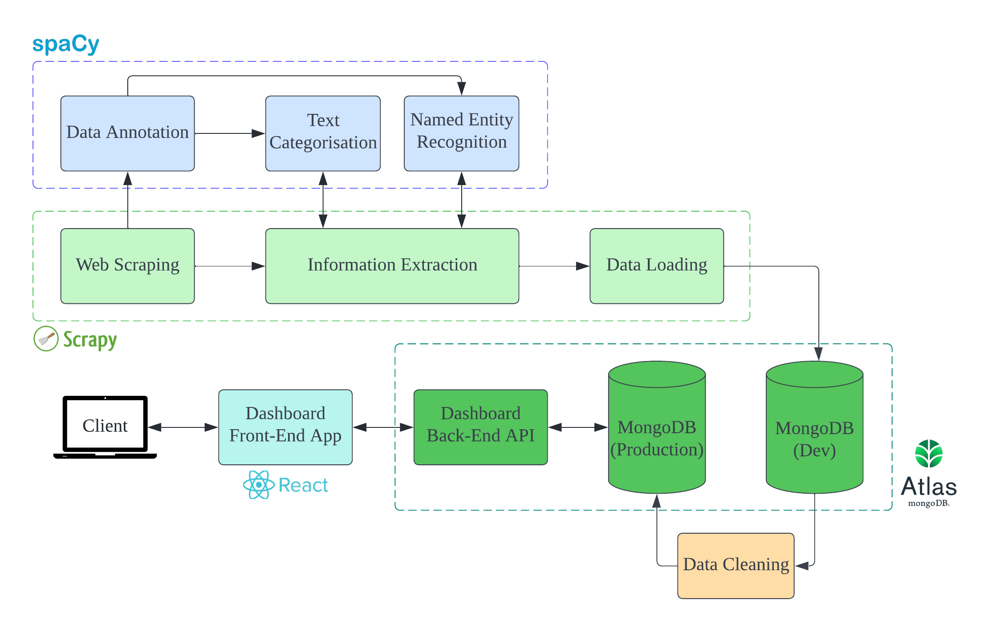

# Data Skills Analysis

The goal of the project is to analyze the skills required for data-related jobs, including Data Analysts and Data Scientists.

The overall architecture of the project is illustrated in the figure below:



## Data Collection
To collect the data we need, we first run a web scraping program with ``Scrapy`` to get job posting data from [Indeed](https://ca.indeed.com). For each job posting, the title, company, location, and description are first extracted and feed into a set of pipelines for subsequent information extraction.

To start web scraping, execute the following command
```
make crawl
```
at the root directory of the project.

## Information Extraction

The information extraction was executed as part of the ``Scrapy`` pipeline, right after web scraping.

It is powered by two major NLP models: Text Categorisation (TextCat) and Named Entity Recognition (NER):

- TextCat: identifying the position category from job posting, e.g., Data Analyst, Data Scientist.

- NER: extracting key requirements from job posting description, e.g., degree, major, programming skills, BI software, database and cloud technologies.

The implementation of the pipelines can be found in [pipelines.py](skills_crawling/pipelines.py).

## Model Training
To ensure performance, we need customised models for both TextCat and NER, rather than pre-trained models for generic texts. The models are trained from the [annotated data](nlp/annotation/), with the NLP package ``spaCy``.

To initiate model training from the annotated data, run 
```
make train-textcat
make train-ner
```
at the root directory of the project.

To edit training configuration for TextCat and NER, such as the model hyperparameters and training parameters, edit the config files [textcat_config.cfg](nlp/textcat_config.cfg) and [ner_config.cfg](nlp/ner_config.cfg), respectively.

## Data Loading
At the end of the ``Scrapy`` pipeline, each of the job entry, consisting of the title, company, location, and required skills, will be loaded into a MongoDB database for further processing and analysis.

This loading pipeline can also be found in [pipelines.py](skills_crawling/pipelines.py).

## Data Cleaning
Before the data is ready for analysis and visualisation, it needs to be cleaned as the NER model output contains false positives (i.e., irrelevant information mistaken as key requirements). In addition, the same skills listed in different job postings could have small variations, such as Power BI vs PowerBI.

In view of this, manual data cleaning is necessary to ensure data integrity. This is done in the jupyter notebook [data_cleaning.ipynb](analysis/data_cleaning.ipynb).

The cleaned data will then be inserted back into the MongoDB database, ready for further utilisation.

## Data Visualisation
An interactive dashboard web application is built to visualise the data.